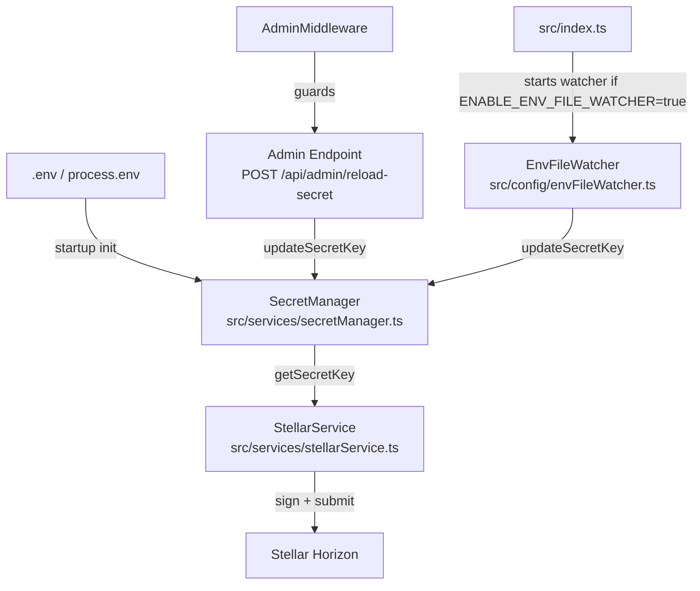
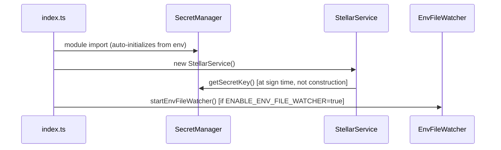
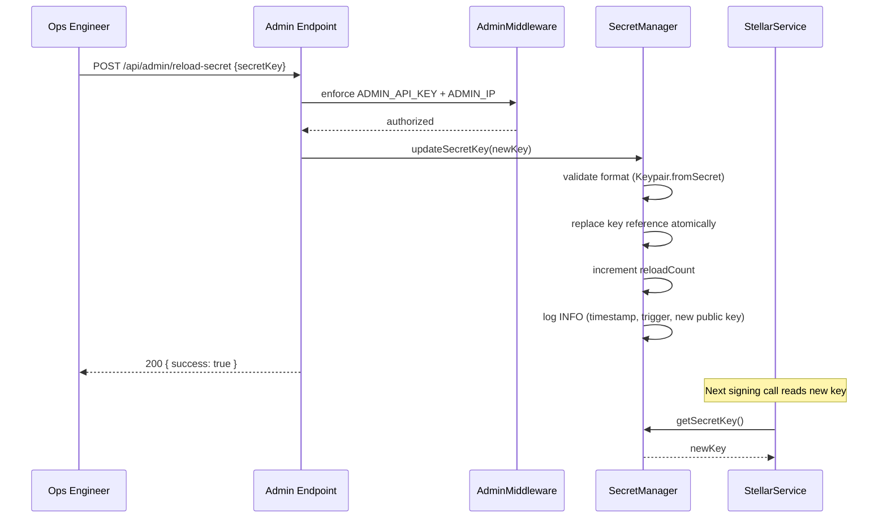

# Design Document: Dynamic Secret Key Reload

## Overview

This feature introduces a runtime secret key rotation mechanism for the StellarFlow backend. Currently, `StellarService` reads `ORACLE_SECRET_KEY` / `SOROBAN_ADMIN_SECRET` once at construction time and holds the resulting `Keypair` for the lifetime of the process. Rotating the key requires a full server restart.

The design introduces a `SecretManager` singleton module that owns the in-memory key, exposes typed accessors, and is the single point of update. Two reload triggers are added on top: an admin HTTP endpoint (`POST /api/admin/reload-secret`) and an optional `.env` file watcher. `StellarService` is refactored to call `getSecretKey()` at signing time rather than at construction time, so every key rotation is reflected immediately without touching any other call site.

Key design goals:

- Zero downtime key rotation
- No race conditions — the key reference is replaced atomically in a single JS assignment
- No secret values in logs, responses, or error messages
- Full backward compatibility with all existing signing flows

## Architecture



### Initialization Order



### Key Reload Flow (Admin Endpoint)



## Components and Interfaces

### SecretManager (`src/services/secretManager.ts`)

The central module. Implemented as a module-level singleton (plain object with closure state) rather than a class, matching the pattern used by `appState.ts`.

```typescript
// Public API
export function getSecretKey(): string;
export function updateSecretKey(newKey: string, trigger?: ReloadTrigger): void;
export function getReloadCount(): number;
export function getPublicKey(): string; // derived from active key, for logging
```

```typescript
export type ReloadTrigger = "admin-endpoint" | "file-watcher" | "startup";
```

Internally, the module holds:

- `let activeKey: string` — the current secret key string
- `let reloadCount: number` — incremented on each successful `updateSecretKey` call

Initialization happens at module load time (top-level code), reading `ORACLE_SECRET_KEY` then `SOROBAN_ADMIN_SECRET` from `process.env`, matching the existing fallback order in `StellarService`.

### Key Validator (internal to SecretManager)

```typescript
function validateKey(candidate: string): void;
```

- Throws `"Secret key must not be empty"` if the trimmed candidate is empty.
- Calls `Keypair.fromSecret(candidate)` inside a try/catch; throws `"Invalid Stellar secret key format"` on failure.
- Never logs or re-throws the candidate value.

### StellarService (modified)

The constructor no longer reads the secret key or creates a `Keypair`. Instead, a `Keypair` is derived from `getSecretKey()` at the point of signing:

```typescript
// Before (construction-time):
this.keypair = Keypair.fromSecret(process.env.ORACLE_SECRET_KEY!)

// After (sign-time):
private getKeypair(): Keypair {
  return Keypair.fromSecret(getSecretKey());
}
```

All calls to `this.keypair` in `submitTransactionWithRetries` and `submitMultiSignedTransaction` are replaced with `this.getKeypair()`. All public method signatures remain unchanged.

### Admin Reload Route (`src/routes/admin.ts` — new handler)

```
POST /api/admin/reload-secret
Headers: x-admin-key: <ADMIN_API_KEY>
Body (optional): { "secretKey": "S..." }
```

Handler logic:

1. If `req.body.secretKey` is present → call `updateSecretKey(req.body.secretKey, "admin-endpoint")`
2. Otherwise → re-read `process.env.ORACLE_SECRET_KEY || process.env.SOROBAN_ADMIN_SECRET` and call `updateSecretKey`
3. On success → `200 { success: true, message: "Secret key reloaded successfully" }`
4. On validation error → `400 { success: false, error: "<message>" }`
5. On unexpected error → `500 { success: false, error: "Failed to reload secret key" }`

The handler never echoes the key value in any response field.

### EnvFileWatcher (`src/config/envFileWatcher.ts`)

Mirrors the pattern of `configWatcher.ts`.

```typescript
export function startEnvFileWatcher(): () => void;
```

- Uses `fs.watch` on `.env` in `process.cwd()`.
- Debounces events with a 500 ms timer (clears and resets on each event).
- On fire: reads `.env` with `dotenv.parse`, extracts `ORACLE_SECRET_KEY` or `SOROBAN_ADMIN_SECRET`.
- Calls `updateSecretKey(newKey, "file-watcher")` if a valid key is found.
- Logs a WARN and skips the update if the key is missing or invalid.
- Returns a cleanup function (`watcher.close()`).

Activated in `src/index.ts` when `process.env.ENABLE_ENV_FILE_WATCHER === "true"`, alongside the existing `watchConfig` call. The cleanup function is stored and called during graceful shutdown.

## Data Models

### In-Memory State (SecretManager)

```typescript
// Module-level private state
let activeKey: string; // current Stellar secret key string
let reloadCount: number = 0; // monotonically increasing, starts at 0
```

No database persistence. The key is ephemeral in-process memory. On restart, the key is re-read from environment variables.

### ReloadTrigger

```typescript
export type ReloadTrigger = "admin-endpoint" | "file-watcher" | "startup";
```

Used only for structured log output — never stored persistently.

### Log Entry Shape (INFO on success)

```
[SecretManager] Key reloaded successfully.
  trigger: "admin-endpoint"
  publicKey: "G..."
  reloadCount: 1
  timestamp: "2024-01-15T10:30:00.000Z"
```

### Log Entry Shape (WARN on failure)

```
[SecretManager] Key reload rejected.
  trigger: "file-watcher"
  reason: "Invalid Stellar secret key format"
  timestamp: "2024-01-15T10:30:00.000Z"
```

Note: the candidate key value is never included in any log entry.

### Admin Endpoint Request/Response

```typescript
// Request body (POST /api/admin/reload-secret)
interface ReloadSecretRequest {
  secretKey?: string; // optional; if absent, re-reads from env
}

// Success response
interface ReloadSecretSuccess {
  success: true;
  message: "Secret key reloaded successfully";
}

// Error response
interface ReloadSecretError {
  success: false;
  error: string; // validation message or "Failed to reload secret key"
}
```

## Correctness Properties

_A property is a characteristic or behavior that should hold true across all valid executions of a system — essentially, a formal statement about what the system should do. Properties serve as the bridge between human-readable specifications and machine-verifiable correctness guarantees._

### Property 1: Key initialization round-trip

_For any_ valid Stellar secret key set as `ORACLE_SECRET_KEY` in the environment before module load, `getSecretKey()` should return that exact key value.

**Validates: Requirements 1.1, 1.3**

---

### Property 2: Key update round-trip

_For any_ valid Stellar secret key passed to `updateSecretKey`, all subsequent calls to `getSecretKey()` should return that new key.

**Validates: Requirements 1.2, 3.3**

---

### Property 3: Invalid key rejected and previous key preserved

_For any_ string that is not a valid Stellar strkey secret (including empty strings and whitespace-only strings), calling `updateSecretKey` should throw an error with the appropriate message, and `getSecretKey()` should still return the previously active key unchanged.

**Validates: Requirements 2.2, 2.3, 2.4**

---

### Property 4: Validation error message never contains the candidate key

_For any_ invalid candidate key string, the error thrown by `updateSecretKey` should not contain the candidate key value as a substring.

**Validates: Requirements 2.2, 8.3**

---

### Property 5: Unauthorized requests to admin endpoint are rejected

_For any_ request to `POST /api/admin/reload-secret` that does not supply a valid `ADMIN_API_KEY` header or originates from a non-whitelisted IP, the response status should be 403.

**Validates: Requirements 5.2**

---

### Property 6: Valid key in request body returns 200 and key is not echoed

_For any_ valid Stellar secret key supplied in the `secretKey` field of the request body to `POST /api/admin/reload-secret`, the response status should be 200 with `{ success: true }`, and the response body should not contain the supplied key value.

**Validates: Requirements 5.3, 5.7, 8.2**

---

### Property 7: Invalid key in request body returns 400

_For any_ invalid key string supplied in the `secretKey` field of the request body, the endpoint should respond with HTTP 400 and `{ success: false, error: "<validation message>" }`.

**Validates: Requirements 5.5**

---

### Property 8: File watcher calls updateSecretKey for valid key changes

_For any_ valid Stellar secret key written to the `.env` file, the file watcher should call `updateSecretKey` with that new key value within the debounce window.

**Validates: Requirements 6.2, 6.3**

---

### Property 9: File watcher does not call updateSecretKey for invalid key changes

_For any_ invalid or missing key value written to the `.env` file, the file watcher should not call `updateSecretKey` and should emit a warning log instead.

**Validates: Requirements 6.4**

---

### Property 10: Debounce prevents redundant reloads

_For any_ sequence of rapid file change events within a 500 ms window, `updateSecretKey` should be called at most once.

**Validates: Requirements 6.5**

---

### Property 11: process.env is not mutated by key updates

_For any_ call to `updateSecretKey` with a new key, the values of `process.env.ORACLE_SECRET_KEY` and `process.env.SOROBAN_ADMIN_SECRET` should remain unchanged after the call.

**Validates: Requirements 7.3**

---

### Property 12: Reload count is monotonically increasing

_For any_ sequence of N successful `updateSecretKey` calls, `getReloadCount()` should equal N after all calls complete.

**Validates: Requirements 9.3**

---

### Property 13: Successful reload log contains public key, not secret key

_For any_ successful `updateSecretKey` call, the emitted INFO log entry should contain the public key derived from the new secret key, and should not contain the secret key value itself.

**Validates: Requirements 9.1, 8.1**

---

### Property 14: Failed reload log contains reason, not candidate key

_For any_ failed `updateSecretKey` call, the emitted WARN log entry should contain the rejection reason and should not contain the rejected candidate key value.

**Validates: Requirements 9.2, 8.1**

---

## Error Handling

### Initialization Errors

- If neither `ORACLE_SECRET_KEY` nor `SOROBAN_ADMIN_SECRET` is set at module load time, `SecretManager` throws `"Stellar secret key not found in environment variables"`. This propagates to `index.ts` and terminates the process (same behavior as the current `StellarService` constructor).

### Validation Errors

| Condition                    | Error Message                         | HTTP Status |
| ---------------------------- | ------------------------------------- | ----------- |
| Empty or whitespace-only key | `"Secret key must not be empty"`      | 400         |
| Non-strkey or invalid format | `"Invalid Stellar secret key format"` | 400         |
| Unexpected internal error    | `"Failed to reload secret key"`       | 500         |

All validation errors leave the active key unchanged.

### File Watcher Errors

- If `.env` does not exist at startup, the watcher logs a warning and returns a no-op cleanup function (same pattern as `configWatcher.ts`).
- If `.env` is unreadable on a change event, the error is caught, logged at WARN level, and the active key is not updated.
- If the parsed key is invalid, `updateSecretKey` throws; the watcher catches this, logs at WARN level, and does not crash.

### StellarService Errors

- `getKeypair()` calls `Keypair.fromSecret(getSecretKey())`. If `SecretManager` is somehow uninitialized (should not happen given module load order), this will throw and propagate up through the existing retry/error handling in `submitTransactionWithRetries`.

## Testing Strategy

### Dual Testing Approach

Both unit tests and property-based tests are required. Unit tests cover specific examples, integration points, and error conditions. Property-based tests verify universal behaviors across many generated inputs.

### Property-Based Testing Library

Use **`fast-check`** (already compatible with the project's TypeScript + Jest setup).

Install: `npm install --save-dev fast-check`

Each property-based test runs a minimum of **100 iterations**.

Tag format for each test:

```
// Feature: dynamic-secret-key-reload, Property <N>: <property_text>
```

### Unit Tests (`test/secretManager.jest.test.ts`)

Specific examples and edge cases:

- `getSecretKey()` returns the key from `ORACLE_SECRET_KEY` on startup (Requirement 1.3)
- `getSecretKey()` falls back to `SOROBAN_ADMIN_SECRET` when `ORACLE_SECRET_KEY` is absent (Requirement 1.3)
- Module throws `"Stellar secret key not found in environment variables"` when neither env var is set (Requirement 1.4)
- `updateSecretKey` with a valid key succeeds and `getSecretKey` returns the new key (Requirement 1.2)
- `getReloadCount()` starts at 0 and increments on each successful update (Requirement 9.3)
- `getPublicKey()` returns the correct public key derived from the active secret (Requirement 9.1)

### Unit Tests (`test/envFileWatcher.jest.test.ts`)

- Watcher calls `updateSecretKey` when a valid key is written to `.env` (Requirement 6.2)
- Watcher does not call `updateSecretKey` when an invalid key is written (Requirement 6.4)
- Watcher debounces: rapid events result in a single `updateSecretKey` call (Requirement 6.5)
- Watcher returns a no-op cleanup when `.env` does not exist (Requirement 6.1)

### Integration Tests (`test/adminReloadSecret.jest.test.ts`)

- Authorized request with valid `secretKey` body → HTTP 200 (Requirement 5.3)
- Authorized request without `secretKey` body → re-reads env, HTTP 200 (Requirement 5.4)
- Unauthorized request (wrong `x-admin-key`) → HTTP 403 (Requirement 5.2)
- Authorized request with invalid `secretKey` → HTTP 400 (Requirement 5.5)
- Response body never contains the submitted key value (Requirement 5.7)

### Property-Based Tests (`test/secretManagerProps.jest.test.ts`)

```typescript
// Feature: dynamic-secret-key-reload, Property 2: Key update round-trip
fc.assert(
  fc.property(validStellarKeyArb, (key) => {
    updateSecretKey(key);
    return getSecretKey() === key;
  }),
  { numRuns: 100 },
);

// Feature: dynamic-secret-key-reload, Property 3: Invalid key rejected and previous key preserved
fc.assert(
  fc.property(invalidKeyArb, (badKey) => {
    const before = getSecretKey();
    expect(() => updateSecretKey(badKey)).toThrow();
    return getSecretKey() === before;
  }),
  { numRuns: 100 },
);

// Feature: dynamic-secret-key-reload, Property 4: Validation error message never contains candidate key
fc.assert(
  fc.property(invalidKeyArb, (badKey) => {
    try {
      updateSecretKey(badKey);
    } catch (e: any) {
      return !e.message.includes(badKey);
    }
    return false; // should have thrown
  }),
  { numRuns: 100 },
);

// Feature: dynamic-secret-key-reload, Property 11: process.env not mutated
fc.assert(
  fc.property(validStellarKeyArb, (key) => {
    const before = { ...process.env };
    updateSecretKey(key);
    return (
      process.env.ORACLE_SECRET_KEY === before.ORACLE_SECRET_KEY &&
      process.env.SOROBAN_ADMIN_SECRET === before.SOROBAN_ADMIN_SECRET
    );
  }),
  { numRuns: 100 },
);

// Feature: dynamic-secret-key-reload, Property 12: Reload count is monotonically increasing
fc.assert(
  fc.property(
    fc.array(validStellarKeyArb, { minLength: 1, maxLength: 20 }),
    (keys) => {
      const before = getReloadCount();
      keys.forEach((k) => updateSecretKey(k));
      return getReloadCount() === before + keys.length;
    },
  ),
  { numRuns: 100 },
);
```

### Arbitraries

```typescript
// Generates valid Stellar secret keys using the SDK
const validStellarKeyArb = fc
  .constant(null)
  .map(() => Keypair.random().secret());

// Generates strings that are not valid Stellar secret keys
const invalidKeyArb = fc.oneof(
  fc.constant(""),
  fc.string().filter((s) => s.trim() === ""), // whitespace-only
  fc.string().filter((s) => {
    try {
      Keypair.fromSecret(s);
      return false;
    } catch {
      return true;
    }
  }),
);
```

### Test File Locations

All new test files follow the existing `test/**/*.jest.test.ts` pattern to be picked up by the Jest config.

| File                                   | Coverage                               |
| -------------------------------------- | -------------------------------------- |
| `test/secretManager.jest.test.ts`      | Unit tests for SecretManager           |
| `test/secretManagerProps.jest.test.ts` | Property-based tests for SecretManager |
| `test/envFileWatcher.jest.test.ts`     | Unit tests for EnvFileWatcher          |
| `test/adminReloadSecret.jest.test.ts`  | Integration tests for admin endpoint   |
